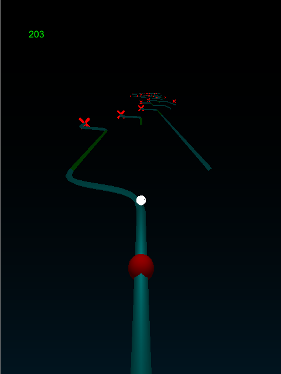

#Brian McNamee | Game Engine Programmer
***
###Branch!

A multiplatform, multithreaded 3D game that I made completely from scratch.

[Source](https://github.com/bwmcname/Branch)

 
***
###Tori

I worked as lead programmer on Tori, a game about exploration. 
 
 
 